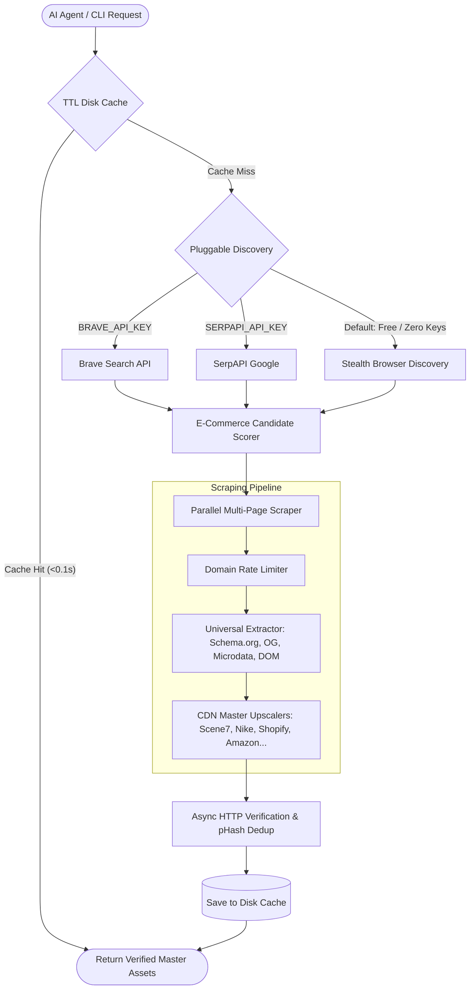

# Promas (Product Image Scraper)

<p align="center">
  
</p>

<p align="center">
  <a href="pyproject.toml"></a>
  <a href="https://github.com/szqiel/promas/actions/workflows/ci.yml"></a>
  <a href="Dockerfile"></a>
  <a href="LICENSE"></a>
  <a href="https://www.python.org/downloads/"></a>
  <a href="https://modelcontextprotocol.io/"></a>
</p>

**Promas** is an automated product image scraper and Model Context Protocol (MCP) server for AI agents.

Instead of writing fragile per-site scrapers that break whenever HTML structures change, Promas combines **Pluggable Search-Driven Discovery** with a **Universal Semantic Extraction Pipeline** and **Extensible CDN-Aware Upscaling**. It reliably extracts master-resolution product photography across any brand or retail site (Apple, Nike, Sony, Amazon, Target, B&H, Best Buy, eBay, Shopify stores, and arbitrary product URLs).

---

## 1. Quickstart

### Option A: Install from PyPI (Recommended)
```bash
pip install promas
playwright install chromium
```

Run instantly from anywhere:
```bash
promas "iPhone 16 Pro"
```

### Option B: Run with Docker (Zero local Python / Playwright setup)
```bash
# Build the Docker image
docker build -t promas .

# Run the FastMCP Server for your AI Agent
docker run -i --rm promas

# Or run the standalone CLI scraper
docker run --rm promas promas "Sony FX3"
```

---

## 2. Architecture & Pipeline



---

## 3. Why Promas? (Comparison)

| Feature | Raw Scripts (`BeautifulSoup`, `Puppeteer`) | Paid APIs (`Bright Data`, `ScrapingBee`) | **Promas** |
| :--- | :--- | :--- | :--- |
| **Cost** | Free | \$50–\$500+/mo recurring | **100% Free & Open-Source (MIT)** |
| **Setup & Maintenance** | Fragile per-site selectors; breaks on redesigns | Generic HTML responses; requires custom parsers | **Search-Driven + Semantic Schemas + CDN Upscalers** |
| **Anti-Bot & Rate Limits** | Blocked quickly by Cloudflare/Akamai | Handled in cloud | **Per-Domain Rate Limiter + Stealth + Tenacity Retries** |
| **Image Verification** | None; returns broken links & 1x1 pixels | Basic status check | **Async HTTP validation + pHash perceptual dedup** |
| **Search Backends** | Hardcoded scrapers | Custom API scrapers | **Pluggable (Brave API / SerpAPI / Browser Fallback)** |
| **Caching** | None | Extra cost | **Built-in TTL Disk Cache (Sub-second repeated queries)** |
| **Image Quality** | Usually captures low-res UI thumbnails | Raw page images only | **Master CDN de-capping (up to 2500px+)** |
| **AI Agent Native** | Manual wrapper needed | REST API only | **Native FastMCP Tool Protocol + Docker support** |

---

## 4. Search Backends & Configuration

Promas works **100% out of the box with zero configuration or API keys required**.

### How Search Discovery Works:
1. **Free / Default (Zero Setup)**: Promas uses its built-in Playwright Stealth browser engine to discover e-commerce candidates via Bing and DuckDuckGo for free.
2. **Brave Search API (Recommended for Production)**: If `BRAVE_API_KEY` is set, Promas switches to official, ToS-compliant, sub-second API discovery.
   - *Get a free key (2,000 free queries/month):* [Brave Search API](https://brave.com/search/api/)
3. **SerpAPI (Alternative)**: If `SERPAPI_API_KEY` is set, Promas queries Google Search via SerpAPI.
   - *Get a free key (100 free queries/month):* [SerpAPI](https://serpapi.com/)

### Environment Variables Reference:

| Variable | Default | Description |
| :--- | :--- | :--- |
| `BRAVE_API_KEY` | *None* | Optional API key for Brave Search |
| `SERPAPI_API_KEY` | *None* | Optional API key for SerpAPI Google Search |
| `PROMAS_GLOBAL_CONCURRENCY` | `3` | Max simultaneous browser contexts |
| `PROMAS_PER_DOMAIN_CONCURRENCY` | `1` | Max concurrent requests per target store |
| `PROMAS_DOMAIN_DELAY_SECONDS` | `0.5` | Polite delay between requests to the same domain |
| `PROMAS_CACHE_ENABLED` | `True` | Toggle disk caching (`True`/`False`) |
| `PROMAS_CACHE_TTL_SECONDS` | `86400` (24h) | Cache expiration time in seconds |
| `PROMAS_ENABLE_IMAGE_VERIFICATION`| `True` | Async HTTP MIME & pixel dimension check |
| `PROMAS_ENABLE_PERCEPTUAL_DEDUP` | `True` | pHash near-duplicate crop removal |
| `PROMAS_PHASH_HAMMING_THRESHOLD` | `4` | Sensitivity threshold for pHash deduplication |

---

## 5. Usage

### A. Standalone CLI

#### Search by Product Name:
```bash
promas "iPhone 16 Pro"
```

#### Extract from a Direct URL:
```bash
promas "https://www.apple.com/iphone-16-pro/"
```

#### Filter by Specific Domain & Limit Count:
```bash
promas "Sony FX3" --max-images 5 --site bhphotovideo.com
```

#### Bypass Cache or Disable Verification:
```bash
promas "Nike Air Jordan 1" --no-cache --no-verify
```

### B. FastMCP Server
Run the standalone MCP server:
```bash
promas-mcp
```

### C. Agent Integration (`mcp_config.json`)

#### Native Python Installation:
```json
{
  "mcpServers": {
    "promas": {
      "command": "promas-mcp",
      "env": {
        "BRAVE_API_KEY": "optional-key-here"
      }
    }
  }
}
```

#### Docker Container (Zero-dependency setup):
```json
{
  "mcpServers": {
    "promas": {
      "command": "docker",
      "args": ["run", "-i", "--rm", "promas"]
    }
  }
}
```

---

## 6. Multi-Tool MCP Suite

Promas exposes dedicated granular tools to AI agents:

| Tool | Purpose | Description |
| :--- | :--- | :--- |
| `fetch_product_images` | **Full Pipeline** | Query string or URL -> Automated discovery -> Parallel scrape -> HTTP validation -> pHash dedup -> Master photo links. |
| `search_product_urls` | **Discovery Only** | Query string -> Fast ranking of candidate e-commerce product pages (returns URLs without scraping images). |
| `scrape_single_url` | **Extraction Only** | Specific direct URL -> Extracts title and master image assets strictly from that page. |

---

## 7. Agent System Prompt Guidelines

Add the following instructions to your AI agent's system prompt:

```text
You have access to the `fetch_product_images` tool (Promas), which universally retrieves high-resolution product imagery and official product links from across the web.

GUIDELINES FOR USING PROMAS:
1. When asked for product images, photos, or visual references, call `fetch_product_images(query=<specific product name or direct URL>)`.
2. Do not invent or hallucinate image URLs; strictly return the verified URLs returned by Promas.
3. Render primary high-res images as markdown (e.g. ``) and provide source product links for reference.
4. If a specific store is desired by the user, you can supply `site_filter` (e.g. `site_filter="apple.com"`).
```

---

## 8. Output Schema

```json
{
  "status": "success",
  "query": "iPhone 16 Pro",
  "title": "Apple iPhone 16 Pro",
  "sources_scraped": [
    "https://www.target.com/p/apple-iphone-16-pro/-/A-93597960",
    "https://www.amazon.com/Apple-iPhone-Version-256GB-Titanium/dp/B0DHJDPYYR",
    "https://www.apple.com/shop/buy-iphone/iphone-16"
  ],
  "images": [
    "https://target.scene7.com/is/image/Target/GUEST_7c0750b4-ee18-41d4-9309-d08e41619229",
    "https://target.scene7.com/is/image/Target/GUEST_4e1ce623-313f-4193-93a4-61dc0fc9da14"
  ],
  "error_message": null
}
```

---

## 9. Contributing

Contributions are warmly welcomed! Adding master upscaling support for a new e-commerce platform or CDN takes **less than 10 lines of code** with our decorator plugin registry.

**See [CONTRIBUTING.md](CONTRIBUTING.md) for step-by-step instructions on adding a new CDN rule.**

---

## 10. Testing & Quality Assurance

Promas includes unit tests for pure parsing functions, type checks, and canary integration tests:

```bash
# Run unit tests
pytest -v

# Run linting
ruff check .

# Run type checker
mypy promas/ tests/

# Run live golden canary integration tests (hits live sites)
pytest -v --run-integration
```

---

## 11. Legal & Ethical Use

- **Public Access Only**: Promas accesses exclusively publicly available web pages; it does not bypass authentication, paywalls, or private logins.
- **Terms of Service**: Automated access may be subject to individual site Terms of Service. Always review target domains' ToS and robot policies before scraping at scale, or supply official search API keys (`BRAVE_API_KEY` / `SERPAPI_API_KEY`) for ToS-compliant discovery.
- **Image Copyright & Attribution**: Promas resolves and returns direct image URLs — it does not store, rehost, or copy media files. Downstream display, storage, or commercial use of retrieved imagery is the user's responsibility.

---

## 12. License

This project is licensed under the [MIT License](LICENSE).


